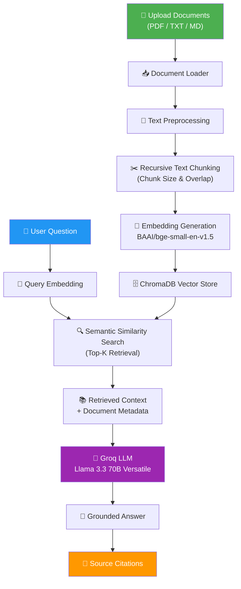
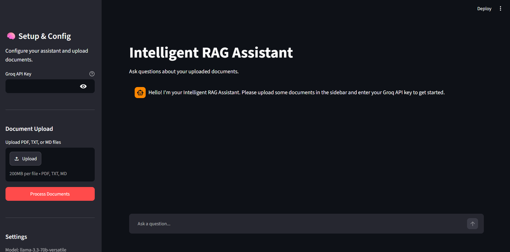
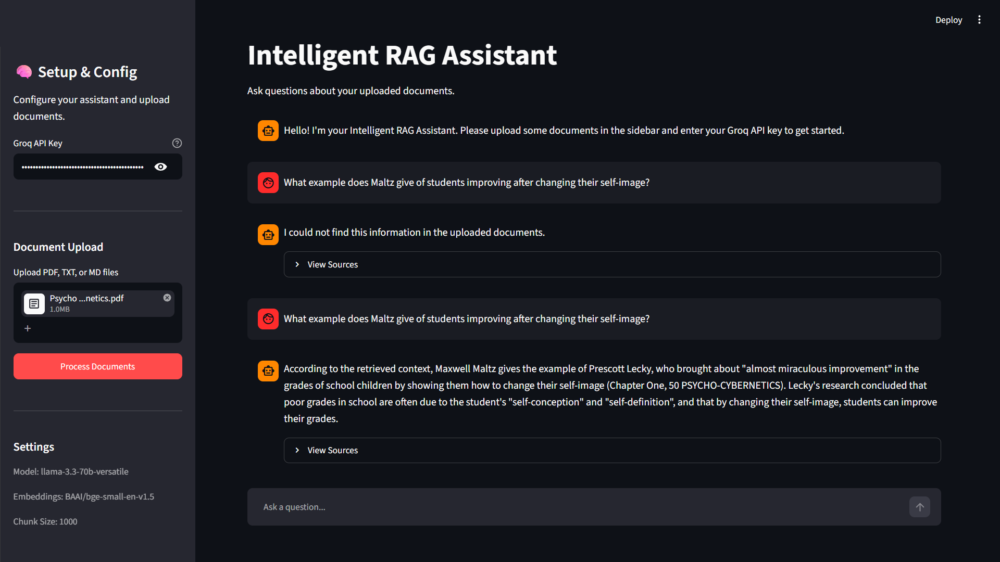
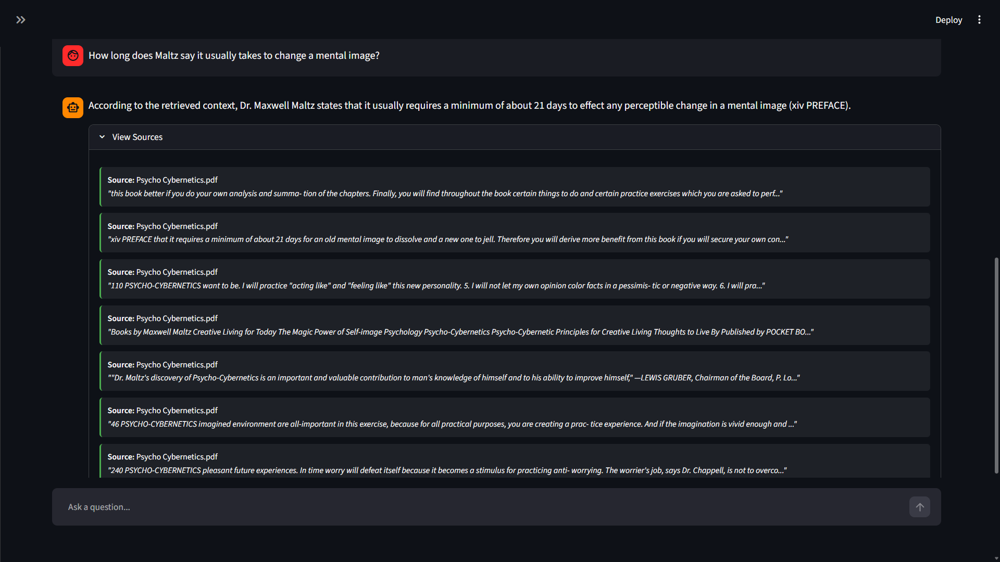

# 🚀 Intelligent RAG Assistant


An Intelligent Retrieval-Augmented Generation (RAG) application that allows users to upload documents and ask questions based on their contents.

The assistant retrieves relevant information from uploaded documents using semantic search and generates accurate, context-aware responses using a Large Language Model (LLM).

Unlike traditional chatbots, the system answers questions only from the uploaded documents and provides source citations to improve transparency and trustworthiness.

---

## 📌 Features

### 📄 Multi-Format Document Support

Supports:

* PDF (.pdf)
* Markdown (.md)
* Text (.txt)

### 🔍 Semantic Search

* Converts document chunks into embeddings
* Stores embeddings in ChromaDB
* Retrieves the most relevant content for each query

### 🤖 LLM-Powered Responses

* Uses Groq-hosted Llama models
* Generates context-aware answers
* Restricts responses to retrieved document content

### 📚 Source Citations

Each answer includes supporting document chunks for transparency.

### ⚡ Retrieval-Augmented Generation (RAG)

Pipeline:

Document Upload → Text Extraction → Chunking → Embeddings → ChromaDB → Retrieval → LLM Response

### 🎨 User-Friendly Interface

* Built with Streamlit
* Simple document upload workflow
* Interactive chat interface

### 🔒 Hallucination Control

If information is unavailable in the uploaded documents, the assistant responds with:

> "I could not find this information in the uploaded documents."

---

## 🏗️ System Architecture


### Check the Application: 
## https://intelligent--rag--assistant.streamlit.app


## 🛠️ Tech Stack

### Language

* Python

### Frameworks

* LangChain
* Streamlit

### Vector Database

* ChromaDB

### Embedding Model

* BAAI/bge-small-en-v1.5

### Large Language Model

* Llama 3 (via Groq API)

### Additional Libraries

* LangChain Chroma
* LangChain Groq
* Sentence Transformers
* PyPDF
* Streamlit

---

## 📂 Project Structure

```text
Intelligent-RAG-Assistant
│
├── config
│   ├── __init__.py
│   └── settings.py
│
├── frontend
│   ├── __init__.py
│   └── app.py
│
├── rag
│   ├── embeddings
│   │   └── embedding_manager.py
│   │
│   ├── ingestion
│   │   ├── loader.py
│   │   ├── preprocessor.py
│   │   └── chunker.py
│   │
│   ├── llm
│   │   ├── llm_factory.py
│   │   └── chain.py
│   │
│   ├── retrieval
│   │   └── retriever.py
│   │
│   └── vector_store
│       └── chroma_store.py
│
├── tests
│
├── utils
│   ├── logger.py
│   └── exceptions.py
│
├── vector_db
│
├── requirements.txt
├── .env.example
└── .gitignore
```

---

## ⚙️ Installation

### 1. Clone the Repository

```bash
git clone https://github.com/your-username/Intelligent-RAG-Assistant.git

cd Intelligent-RAG-Assistant
```

### 2. Create Virtual Environment

### Windows

```bash
python -m venv venv

venv\Scripts\activate
```

### Linux / Mac

```bash
python -m venv venv

source venv/bin/activate
```

## 3. Install Dependencies

```bash
pip install -r requirements.txt
```

---

## 🔑 Getting a Groq API Key

1. Visit: 
https://console.groq.com

2. Sign in or create an account.

3. Navigate to:
API Keys → Create API Key

4. Copy your API key.

5. Paste the key into the application sidebar when prompted.

---

### ▶️ Running the Application

Start the Streamlit application:

```bash
python -m streamlit run frontend/app.py
```

Default URL:

```text
http://localhost:8501
```

---

## 📖 How to Use

### Step 1

Launch the application.

### Step 2

Enter your Groq API key.

### Step 3

Upload one or more documents.

Supported formats:

* PDF 
* TXT
* MD

### Step 4

Click:

```text
Process Documents
```

### Step 5

Ask questions about the uploaded content.

Example:

```text
Summarize the document.

What are the key ideas discussed?

Explain chapter 3 in simple terms.

What is the author's main argument?
```

---

## 📸 Screenshots

### Home


### Question & Answers


### Sources


---

## 🚧 Future Enhancements

* Multi-document filtering
* Hybrid Search (BM25 + Vector Search)
* Reranking
* Chat History Persistence
* User Authentication
* Document Management Dashboard

---

## 💡 Key Learnings

Through this project, I gained hands-on experience with:

* Retrieval-Augmented Generation (RAG)
* Vector Databases
* Embedding Models
* LangChain
* LLM Integration
* ChromaDB
* Semantic Search
* Streamlit Development
* AI Application Deployment

---

## ⭐ Conclusion

The Intelligent RAG Assistant demonstrates how Retrieval-Augmented Generation can improve the reliability and accuracy of AI systems by grounding responses in user-provided documents.

By combining semantic search, vector databases, embeddings, and Large Language Models, the project provides a practical implementation of modern AI-powered document question-answering systems.
